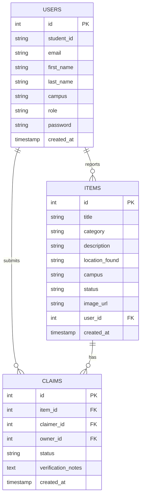

<div align="center">


# 🎓 CampusFind

### *Lost & Found System for College Communities*

[](https://nodejs.org/)
[](https://expressjs.com/)
[](https://www.mysql.com/)
[](https://jwt.io/)
[](LICENSE)
[](http://makeapullrequest.com)

**A comprehensive RESTful API for managing lost and found items on college campuses**

*Students report items • Search belongings • Submit claims with complete verification workflow*

[🚀 Quick Start](#-quick-start) • [📖 API Docs](#-api-endpoints) • [🎯 Features](#-features) • [🧪 Testing](#-testing)


</div>

---

## ✨ Highlights

<table>
<tr>
<td width="33%" align="center">

<h3>Secure Auth</h3>
<p>JWT-based authentication with .on.ca email verification</p>
</td>
<td width="33%" align="center">

<h3>Smart Search</h3>
<p>Advanced filtering by category, campus, status with pagination</p>
</td>
<td width="33%" align="center">

<h3>Claim System</h3>
<p>Complete staff verification workflow for item claims</p>
</td>
</tr>
</table>

---

## 🎯 Features

<details open>
<summary><b>🔐 Core Functionality</b></summary>
<br>

- ✅ **User Authentication** - Secure JWT-based login with .on.ca email verification
- ✅ **Item Management** - Report lost/found items with images, full CRUD operations  
- ✅ **Advanced Search** - Filter by category, campus, status with pagination
- ✅ **Claim Verification** - Submit claims with complete staff review workflow
- ✅ **Role-Based Access** - Student and staff permissions enforced
- ✅ **Image Uploads** - Support for item photos (JPG, PNG, GIF, WebP)

</details>

<details>
<summary><b>🚀 Production Features</b></summary>
<br>

- ✅ **Live Database** - Hosted on FreDB.tech, fully operational
- ✅ **Sample Data** - 6 users, 13+ items, 6+ claims pre-loaded
- ✅ **Comprehensive Testing** - Full test suite covering all endpoints
- ✅ **Security First** - Password hashing, JWT tokens, input validation
- ✅ **Error Handling** - Robust error responses with proper status codes
- ✅ **RESTful Design** - Standard HTTP methods and response formats

</details>

---

## 🛠️ Tech Stack

<div align="center">

| Backend | Frontend | Database | Auth |
|:-------:|:--------:|:--------:|:----:|
|  |  |  |  |
|  |  |  |  |
|  |  | | |

</div>

---

## 🚀 Quick Start

### Prerequisites

```bash
✓ Node.js v14+ installed
✓ npm package manager
✓ Port 5000 available (or modify in .env)
```

### Installation

```bash
# 1️⃣ Navigate to project directory
cd campusfind

# 2️⃣ Install dependencies
npm install

# 3️⃣ Start the server
npm start
```

> 🎉 Production URL: **`https://campusfind-0463.onrender.com`**

<details>
<summary><b>Local Development</b></summary>
<br>

For local testing with auto-reload:

```bash
npm run dev
```

</details>

---

## 📁 Project Architecture

```
campusfind/
│
├── 🔧 config/
│   ├── database.js              # MySQL connection pool
│   └── setupDatabase.js         # DB initialization & sample data
│
├── 🎮 controllers/
│   ├── authController.js        # Authentication logic
│   ├── itemController.js        # Item CRUD operations
│   └── claimController.js       # Claim management
│
├── 🛡️ middleware/
│   ├── auth.js                  # JWT verification
│   └── upload.js                # File upload handling
│
├── 💾 models/
│   ├── User.js                  # User data layer
│   ├── Item.js                  # Item data layer
│   └── Claim.js                 # Claim data layer
│
├── 🌐 routes/
│   ├── authRoutes.js            # Auth endpoints
│   ├── itemRoutes.js            # Item endpoints
│   └── claimRoutes.js           # Claim endpoints
│
├── 🎨 public/
│   ├── index.html               # Frontend UI
│   ├── javascripts/             # Client scripts
│   └── stylesheets/             # CSS files
│
├── 📸 uploads/                  # Item images
│
├── 📄 server.js                 # Express configuration
└── 🧪 test_api.js              # API test suite
```

---

## 🔌 API Endpoints

### 🔑 Authentication

| Method | Endpoint | Description | Auth |
|:------:|----------|-------------|:----:|
| <kbd>POST</kbd> | `/api/auth/register` | Create new account | - |
| <kbd>POST</kbd> | `/api/auth/login` | User login | - |

### 📦 Items

| Method | Endpoint | Description | Auth |
|:------:|----------|-------------|:----:|
| <kbd>POST</kbd> | `/api/items/found` | Report found item | 🔐 |
| <kbd>POST</kbd> | `/api/items/lost` | Report lost item | 🔐 |
| <kbd>GET</kbd> | `/api/items` | List all items (filterable) | - |
| <kbd>GET</kbd> | `/api/items/:id` | Get item details | - |
| <kbd>PUT</kbd> | `/api/items/:id` | Update item | 🔐 |
| <kbd>PUT</kbd> | `/api/items/:id/status` | Update status | 👮 Staff |
| <kbd>DELETE</kbd> | `/api/items/:id` | Delete item | 👮 Staff |

### 📋 Claims

| Method | Endpoint | Description | Auth |
|:------:|----------|-------------|:----:|
| <kbd>POST</kbd> | `/api/claims` | Submit claim | 🔐 |
| <kbd>GET</kbd> | `/api/claims/:id` | Get claim details | 🔐 |
| <kbd>GET</kbd> | `/api/claims/user/my-claims` | Get user's claims | 🔐 |
| <kbd>GET</kbd> | `/api/items/:id/claims` | Get item's claims | 🔐 |
| <kbd>PUT</kbd> | `/api/claims/:id` | Update claim | 🔐 |
| <kbd>PUT</kbd> | `/api/claims/:id/verify` | Verify claim | 👮 Staff |
| <kbd>DELETE</kbd> | `/api/claims/:id` | Cancel claim | 🔐 |

**Legend:** 🔐 = User Auth Required | 👮 = Staff Only

---

## 🔍 Query Parameters

### Search & Filter Items

```http
GET /api/items?category=electronics&campus=Main&status=found&search=phone&limit=10&page=1
```

<table>
<tr>
<th>Parameter</th>
<th>Options</th>
<th>Example</th>
</tr>
<tr>
<td><code>category</code></td>
<td>electronics, textbooks, keys, id_cards, clothing, bags, other</td>
<td><code>?category=electronics</code></td>
</tr>
<tr>
<td><code>campus</code></td>
<td>Main, Waterloo, Cambridge</td>
<td><code>?campus=Main</code></td>
</tr>
<tr>
<td><code>status</code></td>
<td>lost, found, claimed</td>
<td><code>?status=lost</code></td>
</tr>
<tr>
<td><code>search</code></td>
<td>Text search in title/description</td>
<td><code>?search=iPhone</code></td>
</tr>
<tr>
<td><code>limit</code></td>
<td>Items per page (default: 20)</td>
<td><code>?limit=10</code></td>
</tr>
<tr>
<td><code>page</code></td>
<td>Page number (default: 1)</td>
<td><code>?page=2</code></td>
</tr>
</table>

---

## 💾 Database Schema

<div align="center">



</div>

---

## 🧪 Testing

Run the comprehensive test suite:

```bash
node test_api.js
```

### Test Coverage

<div align="center">

| Category | Tests |
|:--------:|:-----:|
| ✅ Authentication | Register, Login |
| ✅ Items CRUD | Create, Read, Update, Delete |
| ✅ Claims CRUD | Create, Read, Update, Verify, Delete |
| ✅ Authorization | Role-based access control |
| ✅ Status Transitions | Workflow validation |
| ✅ Error Handling | Validation & permissions |

</div>

### Manual Testing Examples

```bash
# Get all items (Production)
curl https://campusfind-0463.onrender.com//api/items

# Filter by category
curl "https://campusfind-0463.onrender.com//api/items?category=electronics&status=lost"

# Register user
curl -X POST https://campusfind-0463.onrender.com//api/auth/register \
  -H "Content-Type: application/json" \
  -d '{
    "student_id": "001",
    "email": "user@on.ca",
    "password": "pass123",
    "first_name": "John",
    "last_name": "Doe"
  }'
```

---

## 🔒 Security Features

<div align="center">

| Feature | Implementation |
|:-------:|:--------------:|
| 🔐 Password Hashing | Bcryptjs (10 rounds) |
| 🎫 Authentication | JWT tokens (7-day expiry) |
| ✉️ Email Validation | .on.ca domain enforcement |
| 👥 Access Control | Role-based permissions |
| 📁 File Validation | Type & size checking |
| 🛡️ SQL Safety | Parameterized queries |
| ✅ Input Validation | All endpoints validated |
| 🚫 Error Handling | No sensitive data leakage |

</div>

---

## 📤 File Upload

### Supported Formats

<div align="center">


**Max Size:** 5MB | **Storage:** `./uploads/` directory

</div>

### Upload Example

```bash
curl -X POST https://campusfind-0463.onrender.com//api/items/found \
  -H "Authorization: Bearer <your-token>" \
  -F "title=Lost iPhone" \
  -F "category=electronics" \
  -F "description=iPhone 13 Pro" \
  -F "location_found=Library" \
  -F "campus=Main" \
  -F "image=@/path/to/image.jpg"
```

---

## ⚙️ Configuration

### Environment Variables

The `.env` file is **pre-configured** for production (FreDB.tech):

```env
# Server
PORT=5000
NODE_ENV=production

# Database (FreDB.tech - Production)
DB_HOST=sql.freedb.tech
DB_USER=freedb_dhruvjivani
DB_PASSWORD=NzWef2g$*mjjAY?
DB_NAME=freedb_campusfind
DB_PORT=3306

# Authentication
JWT_SECRET="secreatkeyforcampusfindapp"
JWT_EXPIRE=7d

# File Upload
MAX_FILE_SIZE=5000000
UPLOAD_PATH=./uploads/
```

<details>
<summary><b>Local Development Setup</b></summary>
<br>

To use a local database instead:

```env
# Comment out production settings
# DB_HOST=sql.freedb.tech
# DB_USER=freedb_dhruvjivani
# ...

# Uncomment local settings
DB_HOST=localhost
DB_USER=root
DB_PASSWORD=
DB_NAME=campusfind_db
NODE_ENV=development
```

Then initialize:

```bash
node config/setupDatabase.js
npm start
```

</details>

---

## 🚨 HTTP Status Codes

<div align="center">

| Code | Status | Description |
|:----:|:------:|:------------|
| `200` | ✅ OK | Successful GET request |
| `201` | ✅ Created | Resource successfully created |
| `400` | ❌ Bad Request | Invalid data format |
| `401` | ❌ Unauthorized | Missing/invalid JWT token |
| `403` | ❌ Forbidden | Insufficient permissions |
| `404` | ❌ Not Found | Resource doesn't exist |
| `500` | ❌ Server Error | Internal server error |

</div>

### Error Response Format

```json
{
  "message": "Descriptive error message",
  "error": {
    "code": "ERROR_CODE",
    "details": "Additional information"
  }
}
```

---

## 🐛 Troubleshooting

<details>
<summary><b>Common Issues & Solutions</b></summary>
<br>

| Issue | Solution |
|:------|:---------|
| 📦 Dependencies missing | Run `npm install` |
| 🔌 Database connection fails | Verify MySQL running, check `.env` credentials |
| 🚪 Port 5000 already in use | Change `PORT` in `.env` or kill process on port 5000 |
| 🎫 JWT token expired | Re-authenticate via `/api/auth/login` |
| 📁 File upload fails | Check file size < 5MB and format is JPG/PNG/GIF/WebP |
| 📦 `Cannot find module` | Run `npm install` again |
| 🔒 `EADDRINUSE` error | Another process is using the port |

### Debug Commands

```bash
# Check versions
node --version
npm --version

# Test database
node config/setupDatabase.js

# View logs
npm start

# Verbose logging
DEBUG=* npm start
```

</details>

---

## 📚 Documentation

<div align="center">

| Document | Description |
|:--------:|:-----------:|
| 📖 [documentation.txt](documentation.txt) | Complete API reference & examples |
| 🚀 [DEPLOYMENT_GUIDE.md](DEPLOYMENT_GUIDE.md) | Deploy to Render, Heroku, Railway |
| ⚡ [QUICK_DEPLOY.md](QUICK_DEPLOY.md) | Copy-paste deployment commands |
| 📋 [PROJECT_SUMMARY.md](PROJECT_SUMMARY.md) | Full project overview |
| 🗂️ [INDEX.md](INDEX.md) | Documentation navigation |

</div>

---

## 📊 Project Stats

<div align="center">


**16 API Endpoints** • **6 Sample Users** • **13+ Items** • **6+ Claims**

</div>

---

## 🤝 Contributing

Contributions are welcome! Please feel free to submit a Pull Request.

1. Fork the repository
2. Create your feature branch (`git checkout -b feature/AmazingFeature`)
3. Commit your changes (`git commit -m 'Add some AmazingFeature'`)
4. Push to the branch (`git push origin feature/AmazingFeature`)
5. Open a Pull Request

---

## 📄 License

This project is licensed under the MIT License - see the [LICENSE](LICENSE) file for details.

---

## 📞 Support

Need help? Here's what to do:

1. 📖 Check the [documentation.txt](documentation.txt) for detailed API info
2. 🧪 Review [test_api.js](test_api.js) for usage examples
3. 🔍 Search existing issues on GitHub
4. 🐛 Create a new issue with details

---

<div align="center">


### 🎓 Built with ❤️ for College Communities

**Making lost items found, one campus at a time**

[](https://github.com/dhruvjivani/campusfind)
[](https://github.com/dhruvjivani/campusfind/fork)

[⬆️ Back to Top](#-campusfind)

---

*Last Updated: February 4, 2026*

</div>
